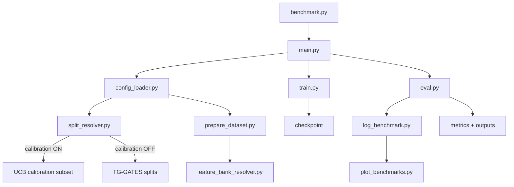

# OAKS Toxicology Benchmark Pipeline

This repository contains a modular benchmarking pipeline for toxicology prediction
using pre-extracted histopathology features at slide or animal level.
It supports pooled feature probes and Multiple Instance Learning (MIL) methods.

The pipeline is designed to:
- Train and validate on **TG-GATES**
- Perform **external out-of-distribution (OOD) evaluation** on **UCB**
- Optional **calibration/fine-tuning** on UCB samples
- Support few-shot learning
- Benchmark multiple encoders and probes at scale
- Produce reproducible metrics and plots

---

## Supported Datasets

### TG-GATES (internal dataset)

Used for training, validation, and optional internal testing.

Required directory structure:

splitting_data/
TG-GATES/
- metadata.csv
- Splits/
  - train.csv
  - val.csv
  - test.csv
- Subsets/
  - val_balanced_subset.csv
- FewShotCompoundBalanced/
  - train_fewshot_k{K}.csv

---

### UCB (external dataset)

Used for external out-of-distribution testing and optional calibration.

Required directory structure:

splitting_data/
UCB/
- metadata.csv
- Subsets/
  - ucb_test.csv

Notes:
- You do **not** need train/val/test splits for UCB
- `ucb_test.csv` contains **all UCB samples**
- UCB is used only for **test** and **calibration** (never for TG-GATES validation)

---

## Feature Bank

This pipeline uses a **feature bank registry** (SQLite) to resolve features on disk.
Configure paths in `configs/base_config.yaml`:

- `features.bank_root`
- `features.registry_path`
- `features.local_bank_root` (optional)

---

## Dataset Selection Logic

Dataset selection is explicit and reproducible:

- `--dataset tggates` → internal training / validation / testing
- `--dataset ucb` → external OOD testing only

UCB is a **test-only** dataset and cannot be used for `stage=train` or `stage=eval`,
but can be used as a **calibration source**.

---

## Pipeline Stages

### Training (stage=train)
- Uses TG-GATES
- Uses full training split, few-shot subsets, or an explicit training subset CSV
- If calibration is enabled, the **calibration train subset** is drawn from UCB

### Validation (stage=eval)
- Uses TG-GATES
- Liver hypertrophy defaults to `TG-GATES/Splits/val.csv`
- Any abnormality uses the resolved `Splits/latest/val.csv`

### Testing (stage=test)
- Uses the configured dataset and subset CSV
- TG-GATES: internal test split (or a subset CSV)
- UCB: external OOD test split (`ucb_test.csv`)
- Loads TG-GATES-trained weights and evaluates without retraining

---

## Running the Pipeline

Move into the pipeline directory:

cd pipeline

Train a single model:

python main.py \
  --config configs/base_config.yaml \
  --dataset tggates \
  --model UNI \
  --probe linear \
  --stage train

Train and validate:

python main.py \
  --config configs/base_config.yaml \
  --dataset tggates \
  --model UNI \
  --probe linear \
  --stage all

External OOD evaluation on UCB:

python main.py \
  --config configs/base_config.yaml \
  --dataset ucb \
  --model UNI \
  --probe abmil \
  --stage test \
  --test_subset_csv splitting_data/UCB/Subsets/ucb_test.csv

---

## Pipeline Flow (Diagram)

---

## Running the Full Benchmark

From the repository root:

python benchmark.py

This will:
- Train on TG-GATES
- Validate on TG-GATES
- Perform external OOD evaluation on UCB (if configured)
- Run both **full** training and **k-shot** when configured in `benchmark.py`
- Skip completed experiments automatically
- Generate benchmark plots per dataset and stage

---

## Outputs

Outputs are written under the experiment root defined in the config, e.g.:

outputs/experiments_benchmark_final/<dataset>/<aggregation>/<encoder>/<probe>/k<k>/

Stage outputs are stored inside the experiment root:

<experiment_root>/
- train/
- validation/
- testing/<dataset>/

Notes:
- TG-GATES results live under TG-GATES experiment roots
- UCB results live under UCB experiment roots (test-only)
- Evaluation and test plots are generated separately

Benchmark summaries and plots are written to:

- `outputs/validation/<dataset>/...`
- `outputs/testing/<dataset>/...`

---

## Design Guarantees

- External datasets never affect TG-GATES validation
- Subset CSVs fully control evaluation samples
- No dataset leakage into model selection
- Reproducible experiments and logging
- Easily extensible to new datasets

---

## Final Notes

- “Subset CSV” defines which samples are evaluated
- UCB is an external out-of-distribution test set by design
- Severity distributions differ across datasets and are reported separately
